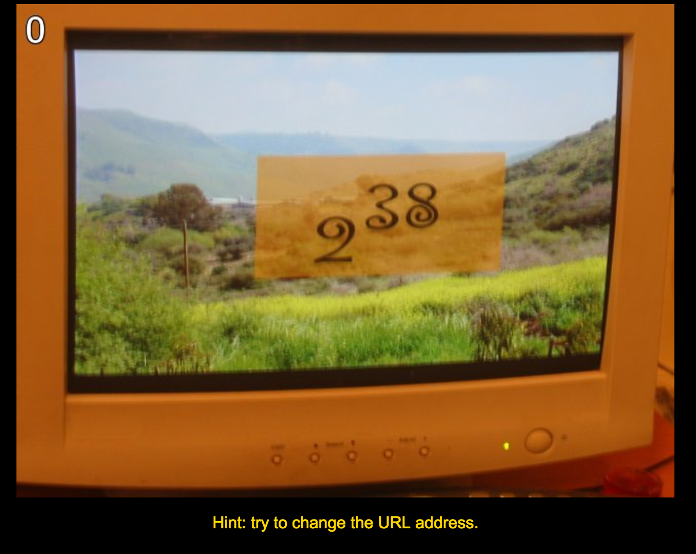

Python Challenge 0번, 1번 풀이
===

원래 한 포스팅에 한개의 문제만 올릴 생각이었으나 0번이 너무 쉬운 관계로 같이 올리겠습니다.

## 0번



Hint에 URL 주소를 바꿔보라고 적혀있습니다.
그리고 2의 38 제곱을 나타내는 듯한 수식 또한 적혀있고, 현재 페이지의 URL은 ~/0.html입니다.

제 로컬은 맥이므로 **맥 기준**으로 설명하겠습니다.

Terminal에서 python을 입력하면 Interpreter가 실행됩니다.
여기서 2**38 을 입력해봅니다.

```python
>>> 2**38
274877906944
```

위와 같은 결과를 얻게 됩니다.
python에서 \*\***\*\* 이 표현은 제곱을 나타낼 때 사용합니다.

따라서 이 숫자를 복사해서 0.html의 0 부분에 붙여넣기 하고 접속하면...

1번으로 가집니다.


저는 1번이 조금 어려웠습니다.(title에 힌트가 있습니다. 모든 문제에)
보시면 

```
K -> M
O -> Q
E -> G
```

저는 처음에 이것들만 단순히 치환시켜주면 되는거 아냐? 라고 가볍게 생각하고 해봤으나 될 리가 없었습니다.
그래서 한참 생각해보니...

```
K -> N -> M
O -> P -> Q
E -> F -> G
```

